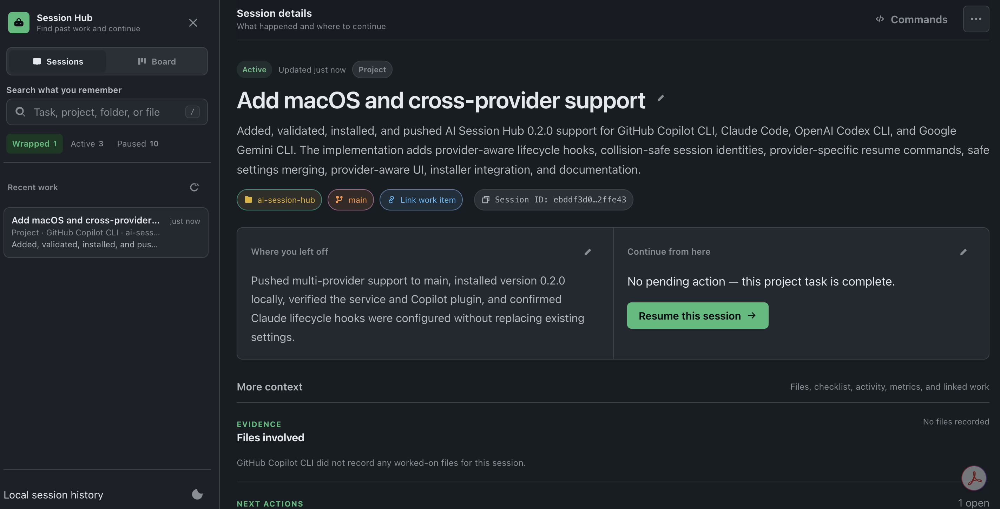
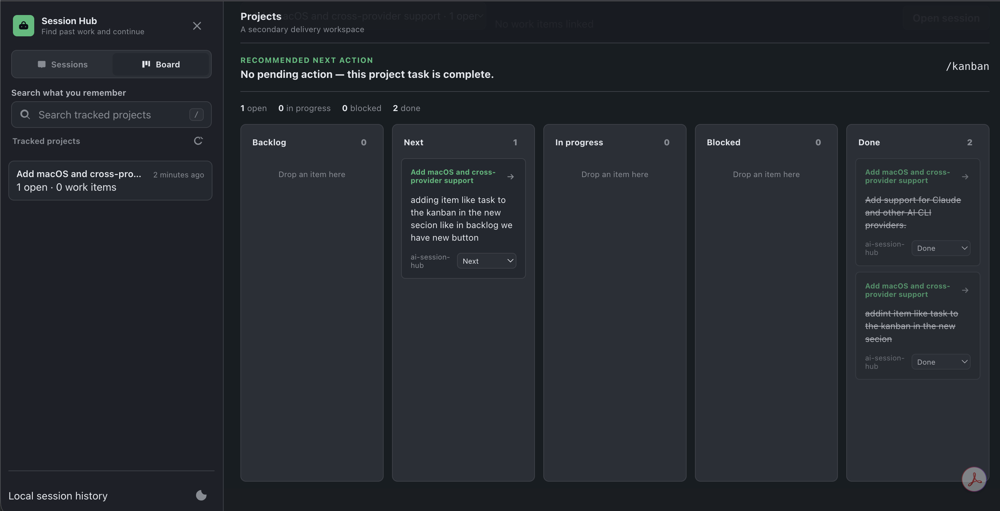

# AI Session Hub

**Local-first continuity for AI coding sessions. Find past work, understand where it stopped, and continue without reconstructing the conversation.**

> Supports **GitHub Copilot CLI**, **Claude Code**, **OpenAI Codex CLI**, and **Google Gemini CLI**.
>
> Independent open source software; not an official GitHub, Microsoft, Anthropic, OpenAI, or Google product.



## Start here

| I want to… | Go to |
|---|---|
| Install AI Session Hub | [Quick start](#quick-start) |
| Set up a specific AI CLI | [Provider guides](docs/providers/README.md) |
| Understand wrapping and resume | [Daily workflow](#daily-workflow) |
| Track work on a Kanban board | [Project board](#project-board) |
| Check storage and privacy | [Data and privacy](#data-and-privacy) |
| Upgrade or uninstall | [Maintenance](#maintenance) |
| Develop or contribute | [Development](#development) |

## At a glance

| Question | Answer |
|---|---|
| What does it do? | Tracks AI CLI sessions and saves clear continuity checkpoints |
| Where does it run? | Locally at `http://127.0.0.1:43120` |
| Where is data stored? | In a local SQLite database |
| Does it upload sessions? | No |
| Which systems are supported? | macOS and Windows |
| Which providers are supported? | Copilot, Claude, Codex, and Gemini |
| Can it resume sessions? | Yes, using the matching provider command |

## What you get

- Automatic lifecycle tracking for supported AI CLIs.
- Search across tasks, summaries, actions, projects, folders, and files.
- Clear **where you left off** and **continue from here** views.
- Structured wrap checkpoints and next-session todo lists.
- Provider-specific resume commands.
- Optional Kanban project tracking.
- Local-only storage with safe upgrades.

## Quick start

### Install manually

Requirements: Git, Node.js 22.5+, a signed-in supported AI CLI, and PowerShell 7 on Windows.

**macOS**

```bash
git clone https://github.com/OAbouHajar/ai-session-hub.git
cd ai-session-hub
./scripts/install.sh
```

**Windows**

```powershell
git clone https://github.com/OAbouHajar/ai-session-hub.git
cd ai-session-hub
pwsh -File .\scripts\install.ps1
```

The installer detects available providers, preserves existing settings and session data, configures the required hooks, starts the local service, and opens the dashboard.

<details>
<summary><strong>Ask an AI CLI to install it</strong></summary>

Copy this prompt into Copilot, Claude, Codex, or Gemini:

```text
Install AI Session Hub from https://github.com/OAbouHajar/ai-session-hub on this machine.

Detect the operating system first. On macOS, verify git, Node.js 22.5+, and at least one supported AI CLI, then run `./scripts/install.sh --no-open`. On Windows, also verify PowerShell 7 and run `pwsh -File .\scripts\install.ps1 -NoOpen`. Stop on unsupported systems.

Clone the latest main branch into a temporary directory, read the README and matching installer, preserve existing Session Hub data and unrelated AI CLI settings, and configure every detected provider. Verify `http://127.0.0.1:43120/api/health` returns `ok: true`, open the dashboard, and report the installed version, configured providers, and any remaining restart or trust action. Proceed autonomously and only ask before administrator-required or destructive actions.
```

Full prompts: [macOS](docs/copilot-install-prompt-macos.md) · [Windows](docs/copilot-install-prompt.md)

</details>

## Provider support

| Provider | Tracking | Resume | Wrap interaction | Guides |
|---|---|---|---|---|
| GitHub Copilot CLI | Yes | `copilot --resume=<id>` | `/wrap` or natural language | [Setup](docs/providers/github-copilot/setup.md) · [Usage](docs/providers/github-copilot/usage.md) |
| Claude Code | Yes | `claude --resume <id>` | “Wrap this session” | [Setup](docs/providers/claude-code/setup.md) · [Usage](docs/providers/claude-code/usage.md) |
| OpenAI Codex CLI | Yes | `codex resume <id>` | “Wrap this session” | [Setup](docs/providers/codex/setup.md) · [Usage](docs/providers/codex/usage.md) |
| Google Gemini CLI | Yes | `gemini --resume <id>` | “Wrap this session” | [Setup](docs/providers/gemini/setup.md) · [Usage](docs/providers/gemini/usage.md) |

AI Session Hub uses documented lifecycle hooks rather than unstable provider transcript formats. Historical import is currently available only for supported Copilot CLI history.

## Daily workflow

1. Start or resume a supported AI CLI session.
2. Work normally while AI Session Hub tracks lifecycle events.
3. Before leaving, ask the assistant to **wrap this session** or **checkpoint this session**.
4. Later, search the dashboard for the task, project, folder, action, or file you remember.
5. Review the saved stopping point and next action.
6. Resume from the dashboard.

Copilot also includes:

| Command | Purpose |
|---|---|
| `/wrap` | Save a continuity checkpoint |
| `/wrap-with-next` | Save a checkpoint with an explicit todo list |
| `/kanban` | Build an ordered plan from unfinished work |
| `/kanban-update` | Reconcile board state with actual progress |
| `/kanban-process` | Execute the next actionable board task |

## Project board

Track any session as a project to organize tasks into **Backlog**, **Next**, **In progress**, **Blocked**, and **Done**. Add tasks directly to a column, drag them between states, or let the Kanban commands reconcile progress.



## How it works

```text
Supported AI CLI hooks
          |
          v
Local Node.js service on 127.0.0.1
          |
          v
Local SQLite continuity store
          |
          v
Searchable browser dashboard
```

Hooks record lifecycle events and provide the assistant with the local checkpoint endpoint. A wrap request writes the useful semantic handoff while conversation context is still available.

## Data and privacy

| Item | macOS | Windows |
|---|---|---|
| Session data | `~/Library/Application Support/CopilotSessionHub` | `%LOCALAPPDATA%\CopilotSessionHub` |
| Application | `~/Library/Application Support/AI Session Hub/app` | `%LOCALAPPDATA%\Programs\CopilotSessionHub` |

- The service binds only to `127.0.0.1`.
- Session data remains local.
- Reinstall, upgrade, and uninstall preserve the SQLite database.
- Existing legacy macOS data in `~/.copilot-session-hub` remains supported.
- Request origin checks and anti-framing headers protect local actions.

## Maintenance

### Upgrade

Pull the latest version and rerun the installer:

```bash
git pull
./scripts/install.sh --no-open
```

```powershell
git pull
pwsh -File .\scripts\install.ps1 -NoOpen
```

### Uninstall

```bash
./scripts/uninstall.sh
```

```powershell
pwsh -File .\scripts\uninstall.ps1
```

Uninstalling removes integrations but leaves session data intact.

## Development

```bash
npm start
npm test
```

The project has no runtime npm dependencies. It uses Node.js built-ins including `node:http`, `node:sqlite`, and the native test runner.

## License

[MIT](LICENSE)
