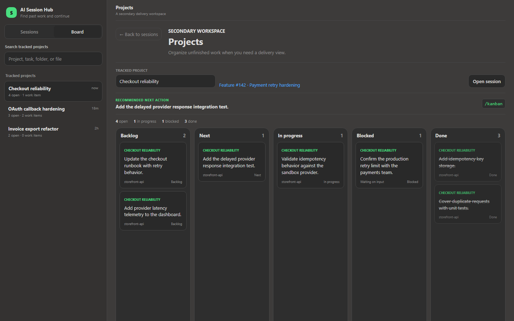

# AI Session Hub

**Local-first continuity for AI coding sessions. Find past work, understand where it stopped, and continue without reconstructing the whole conversation.**

> AI Session Hub currently integrates with **GitHub Copilot CLI**. The project is being designed toward a provider-neutral model for additional AI CLI tools.
>
> This is an independent open source project and is not an official GitHub or Microsoft product.


_The screenshot uses fictional demo data. Your dashboard and session history remain local._

## Why this project matters

AI coding sessions are productive but easy to lose:

- the useful context is trapped in an old terminal session;
- you remember the task, file, or project, but not the session ID;
- a long conversation ends without a reliable handoff;
- the next steps disappear between sessions;
- project work becomes scattered across many AI conversations.

AI Session Hub turns session history into a searchable continuity layer. It answers:

> “I worked with an AI coding assistant on this before. What happened, where did we stop, and how do I continue?”

## What you get

- **Automatic session tracking** through supported GitHub Copilot CLI lifecycle hooks.
- **Wrapped-session focus** so high-quality continuity checkpoints appear first.
- **Normal search** across titles, summaries, actions, tasks, projects, folders, and worked-on files.
- **Recall-first session details** with summary, last completed action, recommended next action, and resume command.
- **Explicit next-session todos** with `/wrap-with-next`.
- **Questions and actions history** with system noise removed and skill calls humanized.
- **Worked-on file evidence** imported from local session history when available.
- **Sessions and Board views** for recall and optional Kanban project tracking.
- **Work item links**, currently supporting Azure DevOps work-item URLs.
- **Local-only storage** and a loopback-only dashboard at `http://127.0.0.1:43120`.
- **Safe upgrades** that preserve existing SQLite session data.

## Quick start

### Option 1: Ask Copilot to install it

Copy this prompt into GitHub Copilot CLI:

```text
Install AI Session Hub from https://github.com/OAbouHajar/ai-session-hub on this Windows machine. Verify git, PowerShell 7, Node.js 22.5+, and Copilot CLI; clone the latest main branch into a temporary directory; read the README and installer; run `pwsh -File .\scripts\install.ps1 -NoOpen`; do not delete or overwrite existing data under `%LOCALAPPDATA%\CopilotSessionHub`; verify `http://127.0.0.1:43120/api/health` returns `ok: true`; open the dashboard; and report the result. Proceed autonomously and only ask before administrator-required or destructive actions.
```

The [full Copilot installation prompt](docs/copilot-install-prompt.md) includes prerequisite recovery, plugin-lock handling, and verification steps.

### Option 2: Install manually

Requirements:

- Windows
- Git
- PowerShell 7 (`pwsh`)
- Node.js 22.5 or newer
- GitHub Copilot CLI, signed in

```powershell
git clone https://github.com/OAbouHajar/ai-session-hub.git
cd ai-session-hub
pwsh -File .\scripts\install.ps1
```

Restart Copilot CLI after installation so the plugin hooks and commands are loaded.

## How to use it

1. Start or resume a GitHub Copilot CLI session.
2. Work normally; the lifecycle appears in AI Session Hub.
3. Before stopping, use one of the wrap commands:

| Command | Purpose |
|---|---|
| `/wrap` | Save a continuity checkpoint inferred from the actual session history |
| `/wrap-with-next` | Save the checkpoint plus your explicit next-session todo list |
| `/kanban` | Generate an ordered plan from genuinely unfinished work |
| `/kanban-update` | Reconcile board state with completed, blocked, and discovered work |
| `/kanban-process` | Select and execute the next actionable board item |

4. Return later and search for anything you remember: a task, project, folder, action, or filename.
5. Review the stopping point and next action.
6. Resume from the dashboard or copy:

```text
copilot --resume=<session-id>
```

## Manage a session as a project board

Any session can become a tracked project without losing its continuity view:

1. Open a session in the **Sessions** view.
2. Expand **More context** and choose **Track as project**.
3. Switch to the **Board** view.
4. Select the tracked project from the sidebar.
5. Add tasks manually, drag cards between columns, or use the AI commands:
   - `/kanban` creates an ordered board from genuinely unfinished session work.
   - `/kanban-update` reconciles completed, blocked, and newly discovered work.
   - `/kanban-process` selects and executes the next actionable card.
6. Link a work item when the project maps to an external tracker.
7. Choose **Open session** at any time to return to the full session context.

The board uses **Backlog**, **Next**, **In progress**, **Blocked**, and **Done** columns.



_Board demo data is fictional._

## How it works

```text
GitHub Copilot CLI hooks
          |
          v
Local Node.js service on 127.0.0.1
          |
          v
Local SQLite continuity store
          |
          v
Searchable browser dashboard
```

- Hook payloads track session lifecycle events.
- `/wrap` runs while conversation context is still available and writes the semantic handoff.
- Existing Copilot CLI session history is imported read-only.
- File paths are stored locally for search, but the browser receives workspace-relative paths or basenames.
- The service does not upload session data.

## Data and privacy

- Service binding: `127.0.0.1` only.
- Session database: `%LOCALAPPDATA%\CopilotSessionHub\sessions.db`.
- Installation directory: `%LOCALAPPDATA%\Programs\CopilotSessionHub`.
- Existing session data is preserved during reinstall and uninstall.
- Request Host/Origin checks and anti-framing headers protect local actions.
- No cloud database, analytics service, or external upload is required.

## Upgrade

Pull the latest version and rerun the installer:

```powershell
git pull
pwsh -File .\scripts\install.ps1 -NoOpen
```

If an active Copilot session locks the loaded plugin files, the installer updates the application, keeps the dashboard available, and prints the exact retry command to run after exiting Copilot.

## Development

```powershell
npm start
npm test
```

The project uses Node.js built-ins, including `node:http`, `node:sqlite`, and the native test runner. There are no runtime npm dependencies.

## Roadmap

- Provider-neutral session and resume adapters.
- Support for additional AI CLI session-history formats.
- Generic work-item providers beyond the current Azure DevOps URL integration.
- Optional packaged installer and release artifacts.

## Uninstall

```powershell
pwsh -File .\scripts\uninstall.ps1
```

Uninstalling leaves the local SQLite session data in place.

## License

[MIT](LICENSE)
