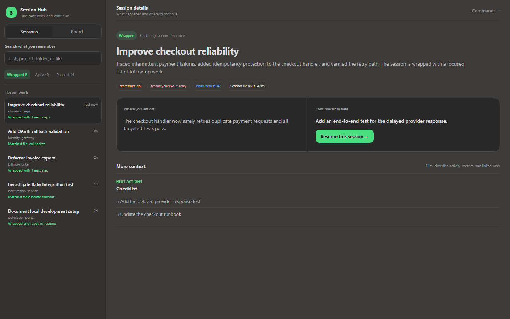

# Copilot Session Hub

A local-first way to find past GitHub Copilot CLI work, understand where it stopped, and continue it.

> This is an independent open source project and is not an official GitHub or Microsoft product.



_Demo data is fictional. The dashboard runs locally and displays your own session history._

## What it provides

- Automatic session tracking through supported Copilot lifecycle hooks.
- A persistent session browser at `http://127.0.0.1:43120`.
- `/wrap` checkpoints containing summaries, last actions, next steps, decisions, and unresolved questions.
- `/wrap-with-next` checkpoints that ask for and preserve an explicit todo list for the next session.
- One normal search across session titles, summaries, actions, projects, working folders, and worked-on file names.
- A recall-first session view showing what the work was, what happened, where it stopped, and the recommended next action.
- Worked-on file evidence synchronized from local Copilot session history when available.
- Filters, pinning, archiving, editable checkpoints, task checklists, activity history, resume, and open-folder actions.
- Explicitly tracked project sessions, each with its own Kanban board using Backlog, Next, In Progress, Blocked, and Done states.
- Work item links attached directly to the project session. Azure DevOps Epic, Feature, PBI, Task, and Bug URLs are supported.
- `/kanban` AI coaching that derives and orders only unfinished work from the current chat history.
- `/kanban-update` board reconciliation and `/kanban-process` coached execution of the next actionable task.
- Header command palette with Session Hub commands plus useful Copilot context, usage, compact, share, and fork shortcuts.
- Automatic startup at Windows sign-in and automatic recovery if a hook runs while the service is stopped.
- Local SQLite storage under `%LOCALAPPDATA%\CopilotSessionHub`.

The service binds only to `127.0.0.1`. It does not upload session data.

## Install

Requires Node.js 22.5 or newer and GitHub Copilot CLI.

### Install with Copilot (recommended)

Copy this prompt into GitHub Copilot CLI:

```text
Install Copilot Session Hub from https://github.com/OAbouHajar/copilot-session-hub on this Windows machine. Verify git, PowerShell 7, Node.js 22.5+, and Copilot CLI; clone the latest main branch into a temporary directory; read the README and installer; run `pwsh -File .\scripts\install.ps1 -NoOpen`; preserve existing data under `%LOCALAPPDATA%\CopilotSessionHub`; verify `http://127.0.0.1:43120/api/health` returns `ok: true`; open the dashboard; and report the result. Proceed autonomously and only ask before administrator-required or destructive actions.
```

The [full installation prompt](docs/copilot-install-prompt.md) includes detailed recovery and verification steps.

For a first installation, the prompt completes setup automatically. When upgrading from inside an active Session Hub Copilot session, Windows may lock the loaded plugin files; the installer will update the application and print one exact PowerShell command to run after exiting Copilot.

### Install manually

```powershell
pwsh -File .\scripts\install.ps1
```

Restart Copilot CLI after installation so its plugin cache and hooks are loaded.

## Use

1. Start or resume a Copilot CLI session.
2. Work normally; lifecycle activity appears in Session Hub.
3. Enter `/wrap` to infer unfinished work, or `/wrap-with-next` to provide your own next-session todo list.
4. When you return, search for anything you remember: the task, project, folder, action, or file name.
5. Review where you stopped, then choose **Resume this session**.

The `sessionEnd` hook preserves lifecycle state after an unexpected exit, but only `/wrap` can produce a high-quality AI summary because it runs while Copilot still has the conversation context.

Projects, Kanban boards, linked work items, metrics, files, and activity remain available as secondary context. The primary workflow is always finding a session and continuing it.

Worked-on file paths remain local. Session Hub stores the original path for local search but returns only workspace-relative paths, or a basename for files outside the workspace, to the dashboard.

## Development

```powershell
npm start
npm test
```

## Uninstall

```powershell
pwsh -File .\scripts\uninstall.ps1
```

Uninstalling leaves the SQLite session data in place.

## License

[MIT](LICENSE)
